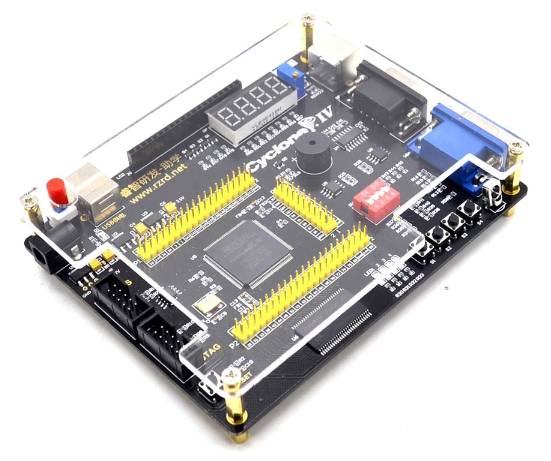
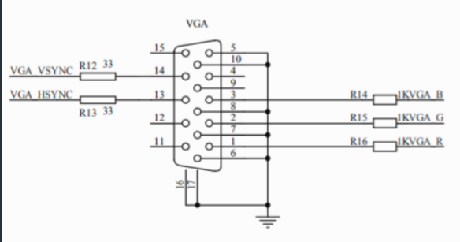
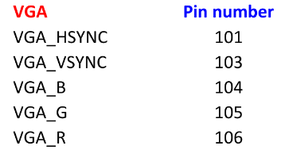
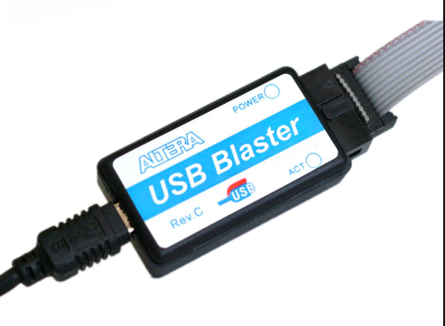
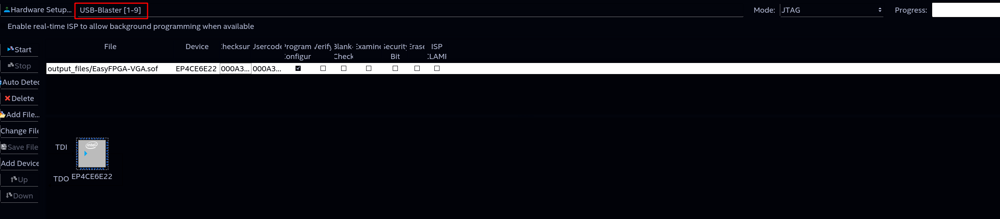
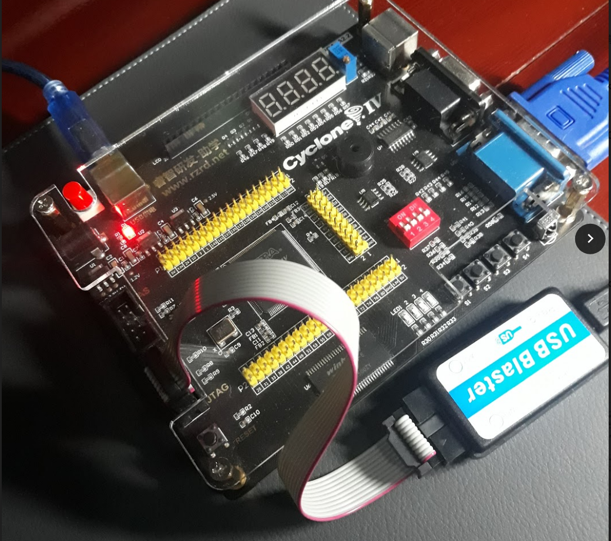
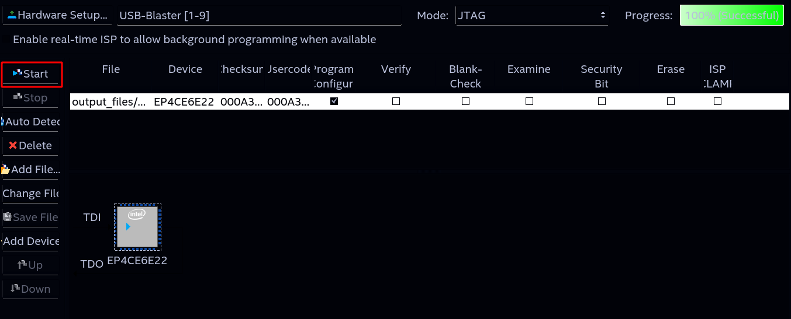
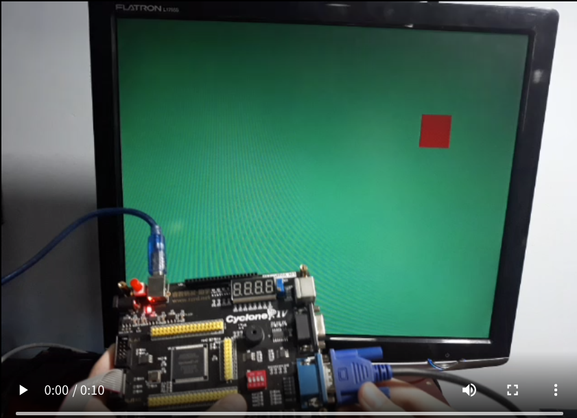

# EasyFPGA-VGA

An example of VGA output using the RZ-EasyFPGA A2.2 board, usually found on AliExpress.

The output is at 640x480 @ 60Hz

This guide is a *work in progress*.

## The board
Usually found on AliExpress for about US$ 40, the RZ-EasyFPGA board provides a *relatively* cheap way into the FPGA world.



The built-in chip is the **Altera Cyclone IV EP4CE6E22C8N**, which should serve well for smaller projects.

In this guide, we'll be using the built-in VGA interface and by the end we should have a working example flashed to the board.

## VGA

For driving a VGA display, you only really need five signals:
- HSync: Horizontal Synchronization
- VSync: Vertical Synchronization
- R: Red channel (analog)
- G: Green channel (analog)
- B: Blue channel (analog)

Since we're working with *digital* signals we'll some some sort of DA conversion for the colors channels.

On our board, we have a simple resistor attached to each channel allowing only 8 colors since each channel is either turned on completely or turned off.



Each of those resistors is connected to the pins shown below



We'll use these pin numbers later on.

## Initial setup
First we need to make sure we have the appropriate environment for working with the board.

For that, we're going to use the [Intel Quartus Prime Lite](https://www.intel.com/content/www/us/en/software/programmable/quartus-prime/download.html) software at version 20.1.1 - the latest version at the time of writing.

Make sure to install the Lite version since it supports the FPGA chip of our the board and to also install any drivers in order to get the USB Blaster working.



For Windows, the instalation process should be straightforward but if you google for it there's plenty of resources.

For GNU/Linux, I've attached some guides below that can help you:
- Arch Linux: https://wiki.archlinux.org/index.php/Altera_Design_Software
- Ubuntu: https://gist.github.com/peach-e/691a0b54b535d70313c97e0af6002aaa

For the rest of this guide, I'll be working on an Arch Linux system.

## Steps

1. Fetching the code
If you're familiar with git, this should be a no brainer:
```sh
$ git clone https://github.com/fsmiamoto/EasyFPGA-VGA.git 
$ cd EasyFPGA-VGA
$ quartus EasyFPGA-VGA.qpf
# If you don't have Quartus on your $PATH, just open the project on the Quartus UI.
```


2. Compile the project

Now we need to build our project. For that you can click on the play icon on the toolbar or press *Ctrl+L*


3. Open the programmer

Now we should be ready to program the board.
Start by opening the *Programmer* tool:


You should see something like this:

Note that our USB Blaster should appear at the top like I've highlighted. 

If you don't see your Blaster there, this is probably a driver issue.



4. Connect the board 

First, power on your board by connecting the an USB cable to it. 

You can also use the power jack built-in into the board with a 5V power-supply.

With that, you can connected the block header cable to the board on the JTAG block.

It should look something like this:



5. Flash the board

With everything connected, click on `Start` on the Programmer tool:


## Result

If everything goes well, it should begin displaying something!

Yay!

[](
https://user-images.githubusercontent.com/20388082/114456652-7b004a80-9bb3-11eb-8057-2584dfc80393.mp4
)

## TODO
- Add section about the Project Setup including the Pin Planner

## Contributing
If you see any mistake on have any questions feel free to open a PR or create an issue.

## Sources:
- https://github.com/jvitkauskas/Altera-Cyclone-IV-board-V3.0
- https://github.com/filippovf/KitEasyFPGA (in Portuguese) 
